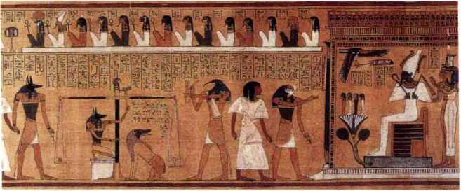
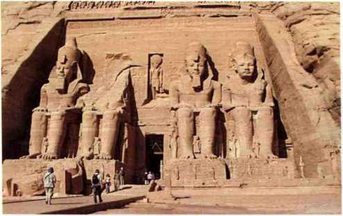

古埃及文明
==========

在西方学术界，文明的标准简单而且清晰，即 **阶级的产生和城市的出现，意味着人类文明的开始**。人类最早的文明始于非洲尼罗河下游，即现在的埃及地区，或者是美索不达米亚。

罗塞塔石碑上面刻着古埃及的两种文字（古埃及象形文字和古埃及拼音文字）及对应的希腊文字，罗塞塔也成为了翻译的代名词。

**我必须学习政治和战争，这样我的孩子才有可能学习数学和哲学以及地理、自然历史等等，然后我的孙子才有机会学习绘画、诗歌、音乐、建筑、编织女红和瓷艺。-- 约翰·亚当斯** 

美国开国元勋之一的约翰·亚当斯的这句名言，很好地概括了在文明的不同发展时期人们关注的问题的区别。前几代的人要考虑生存和安全问题，这就是亚当斯所说的政治和战争的必要性；接下来要考虑社会的建设和发展，离不开科学和工程；当这些事情都做好了以后，人类就会追求艺术等更高精神层面的东西。

**古埃及最杰出的艺术是绘画和雕塑** （包括浮雕）。

元青花本身是多种文明相互融合的产物，早期的青花瓷含有很多伊斯兰元素，而这些伊斯兰元素最初来自于古埃及。

古埃及文明是世界文明史上的一座丰碑，它如此悠长的历史，只有中国和印度可以相比。当圣经中的先知摩西见到埃及文明时，它已经存在了几千年。当恺撒和屋大维仰视金字塔时，他们和大金字塔的时间距离就如同我们和兵马俑的距离一样遥远。

   《亚尼的死者之书》中的“秤心仪式”（收藏于大英博物馆）

   阿布辛拜勒神庙前的四座拉美西斯二世像