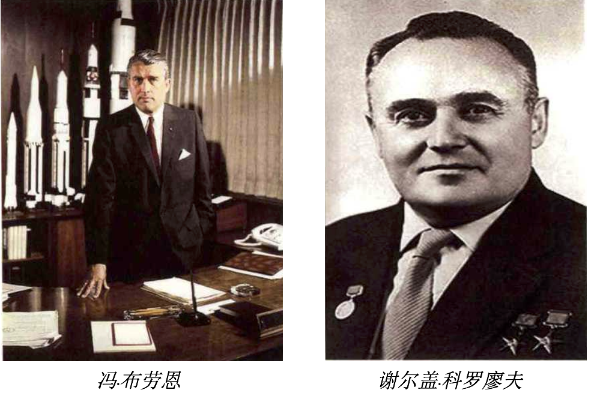
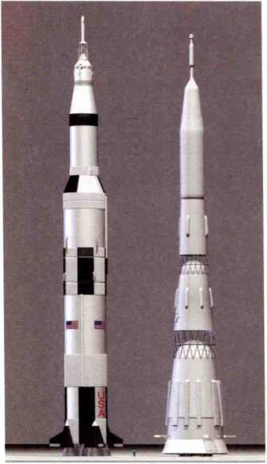

第十六章 太空争霸
=================

军事的需求往往会推动科学技术的发展，而这些技术民用化之后又促进了人类文明的进步。美苏太空争霸导致了太空技术的飞速发展，而在这背后，很大程度上是两个天才的默默竞争。

美国是一个重视人才的国度，他们看中了德国的人才，尤其是掌握火箭技术的精英。相比之下苏联人更看中德国和日本留下的机器设备，他们洗劫了德国的工业区和中国的东北。

冯·卡门后来被誉为美国航空之父。钱学森被誉为中国的导弹之父。冯·布劳恩被美国航天局誉为世界航天史上第一人，他是德国V-2导弹的发明人。谢尔盖·科罗廖夫被誉为前苏联航天之父。

第一回合：人造卫星，科罗廖夫胜。第二回合：载人航天，科罗廖夫再胜。第三回合：登月，冯·布劳恩完胜。

最终美国人多次成功登月而前苏联一次也没有，这里面的根本原因不是科罗廖夫的能力不行，而是前苏联输在了综合国力上。

   土星五号和N1的对比