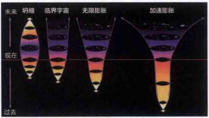

上帝的粒子
==========

“我们从何处来？我们是谁？我们向何处去？”从某种意义上讲，对这三个问题的回答其实成为了衡量我们社会文明程度的标尺。

惠施认为“至大无外，谓之大一；至小无内，谓之小一”，庄周认为“一尺之捶，日取其半，万世不竭”。今天的物理学认为对于物质，不论怎么分，最终总会得到一大堆夸克和一大堆电子之类的粒子。

夸克是纯能量，和光子一样。这个发现很好地解释了以前困惑大家的两个问题。第一，为什么质量和能量可以互相转化，即爱因斯坦著名的公式E=MC2。因为构成物质的基础就是能量。第二，为什么在宇宙大爆炸之初，宇宙只是一个没有体积的质点，因为，宇宙最初是纯能量的，并没有物质，后来能量转变为物质，形成了宇宙中的基本粒子。我们过去常说世界是物质的，现在我们发现其实世界是能量的。

彼得·希格斯提出了一个假设——宇宙中存在一种特殊的场（或者说一种力量），如同一种胶把这些纯能量的东西固定在一起，它赋予了我们宇宙基本粒子的质量、体积和形状。到目前为止，我们发现宇宙中的场只有4种：重力场、电磁场、强核力场、弱核力场。希格斯玻色子的发现，不仅完善了宇宙微观结构的标准模型，同时揭开了宇宙中的质量来源之谜，而且对先前关于宇宙形成的理论做了完美的解释。

   对宇宙终结的几种猜测（从左到右分别是1.宇宙最终通过大挤压回到大爆炸前的初始状态；2.宇宙的密度正好在临界密度放缓膨胀速度；3.宇宙均匀膨胀；4.宇宙加速膨胀）

根据里斯等人的推算，宇宙中我们看得见的物质不超过宇宙的5%，大约有20%—25%是所谓的暗物质，也就是无法观测到但是却存在的物质；剩下来的占据了宇宙70%以上的，是我们一无所知的暗能量。

就目前人类得到的所有科学证据而言，宇宙将是有始无终。

+------------------+--------------------------------+
| 宇宙诞生的时间表 |                                |
+==================+================================+
| 1普朗克          | 重力形成                       |
+------------------+--------------------------------+
| 0.11秒           | 强子形成                       |
+------------------+--------------------------------+
| 10-6秒           | 夸克形成                       |
+------------------+--------------------------------+
| 10-12秒          | 弱核力和电磁力形成             |
+------------------+--------------------------------+
| 10-36秒          | 强力场形成                     |
+------------------+--------------------------------+
| 13秒             | 氦原子核形成                   |
+------------------+--------------------------------+
| 35分钟           | 由强子直接形成原子核的过程终止 |
+------------------+--------------------------------+
