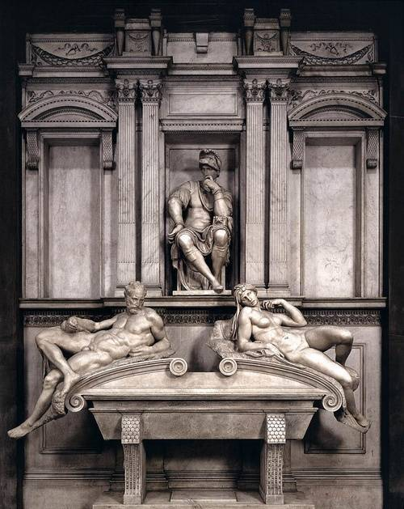

文艺复兴
========

手工业和商业的发展，有时会带来金融业的兴起。经济的发展带动了思想的解放。从13世纪末到14世纪初，佛罗伦萨出了一位了不起的人物但丁。他是旧时代的最后一位诗人，也是新时代的第一位诗人。

科西莫·美第奇开创了一个新时代，期间科学、文化和艺术在佛罗伦萨和意大利开始复兴，同时人文主义的曙光开始出现。圣母百花大教堂的落成，首先标志着文艺复兴的开始，虽然文化和艺术的复兴还需要很长的时间；其次它向欧洲证明，美第奇家族是佛罗伦萨的主人。

   佛罗伦萨圣母百花大教堂

13世纪到18世纪的绘画概括成“天上——天上人间——人间天上——人间”四个阶段。在文艺复兴之前的几个世纪里，几乎所有的绘画题材都是宗教题材，即使在文艺复兴的初期，这种题材仍占多数。艺术从“天上”到“天上人间”的过程，是在洛伦佐时代完成的，这是文艺复兴最重要的时期，也是欧洲人文主义形成和发展的重要时期。洛伦佐是众多艺术家的保护人，从很多方面来看，洛伦佐都称得上是文艺复兴的教父。

.. figure:: img/晨昏.jpg
   :scale: 100%
   :align: center

   洛伦佐·美第奇墓前的“晨与昏”（米开朗基罗作品，佛罗伦萨圣洛伦佐教堂内）

   朱利亚诺·美第奇墓前的“昼与夜”（米开朗基罗作品，佛罗伦萨圣洛伦佐教堂内）

.. figure:: img/创世纪.jpg
   :scale: 100%
   :align: center

   梵蒂冈西斯廷教堂的壁画《创世纪》（天顶）和《最后的审判》（前方墙壁）

到了15世纪中期，威尼斯继佛罗伦萨之后，成为文艺复兴的另一个中心。到了16世纪末，文艺复兴的春风传遍了欧洲。

布鲁诺遭受火刑，并不是因为他支持日心说，而是因为其泛神论的宗教思想与基督教（一神论）的教义相违背。

美第奇家族的女性中间出了许许多多的王后和贵族的妻子，她们把意大利文艺复兴的文化带到了当时还处于蒙昧状态的欧洲各国。

美第奇家族的财产就作为佛罗伦萨的遗产，保留至今。这个家族似乎是专为文艺复兴而存在的，他们的兴起直接导致了文艺复兴。而在文艺复兴终结后，他们似乎也不再有存在的必要，一个王朝式的家族就此终结。