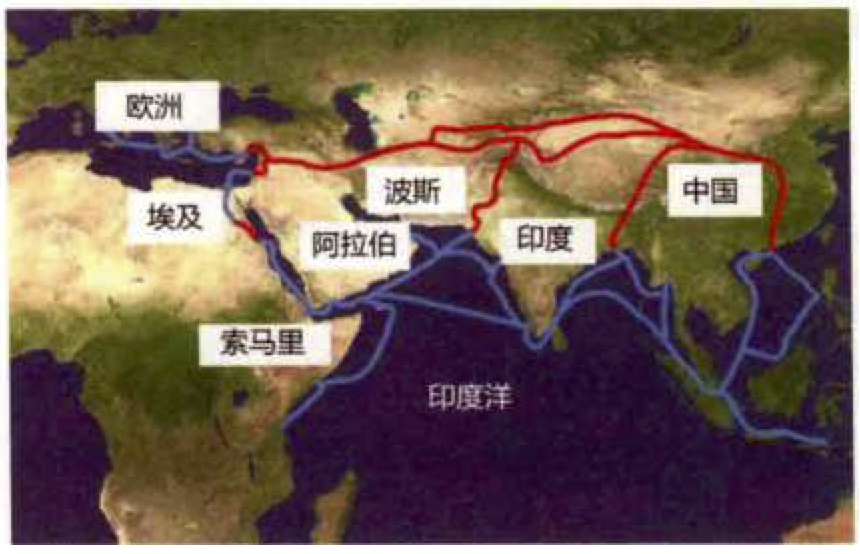
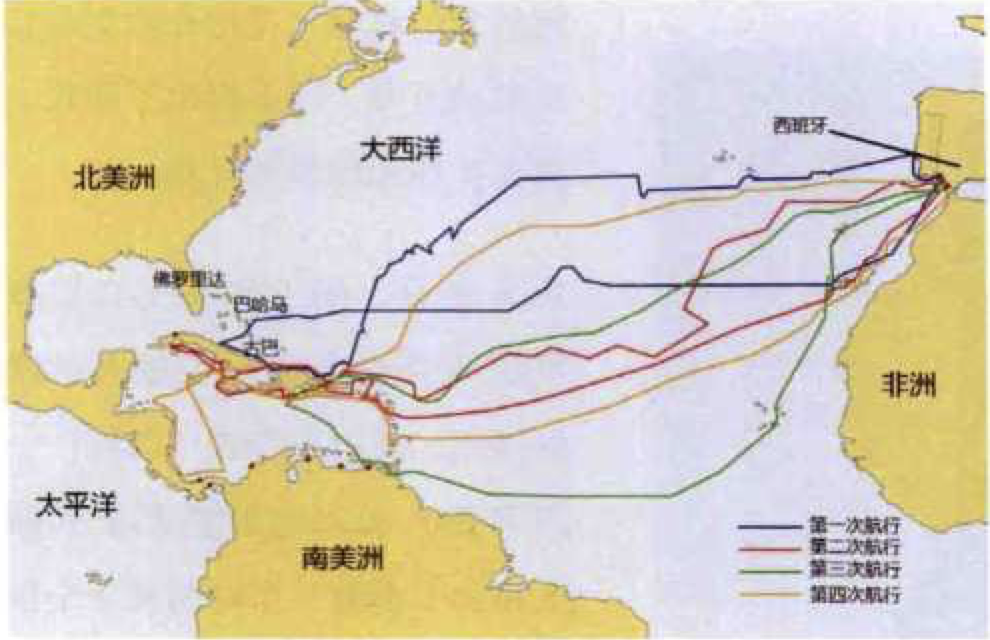
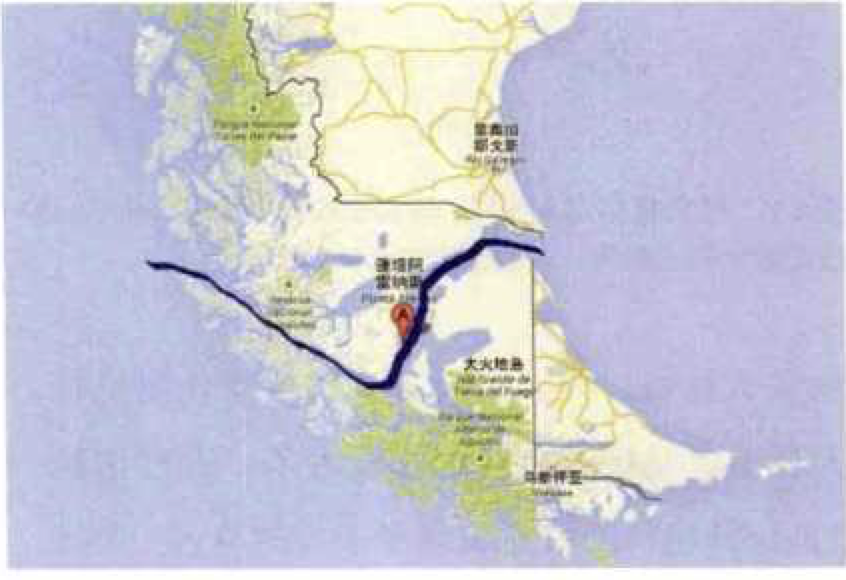
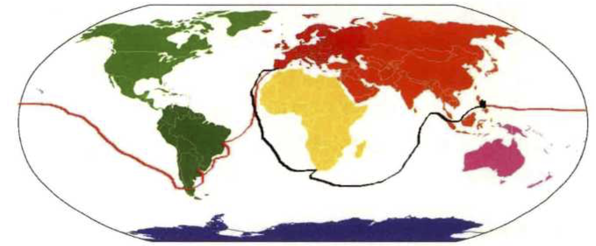

大航海和地理大发现
==================

大航海最初的动机是为了寻找东方的香料。

有人问著名投资大师巴菲特：“世界上最长的衰退期是多长？”他回答道“一千年，在中世纪。”

十字军东征，从军事的角度上讲是彻头彻尾的失败，并且对人类的文明来说也是一场浩劫。

   陆地和海上丝绸之路

很多史学家认为，十字军远征决不像罗马教会描绘的那样，只是想从异教徒手里夺回"上帝灵柩"，远征同时也是为了打破阿拉伯人对红海通道的封锁，但是这一尝试没有成功。到了奥斯曼土耳其帝国崛起之后，欧洲人和东方进行贸易的困境不仅没有改善，反而更加受制于人，于是西欧国家就很自然地要去探寻另外一条通往印度的航线。

欧洲近代的航海始于当时最贫穷、最偏僻的葡萄牙，有其必然原因。葡萄牙位于欧洲大陆最西南端的伊比利亚半岛，即使在地中海航行畅通无阻，货物从遥远的东方运抵葡萄牙，也会变成全欧洲最昂贵的。因此，这个欧洲当时的贫穷小国，最有动力去寻找新的航线。

在各国介绍世界大航海时代的书籍中，总会提到两个其实并没有直接参与欧洲人大航海和地理大发现的航海家——中国的郑和与葡萄牙的恩里克亲王。

   哥伦布四次航行走过的路线

真正证明新大陆并非印度的是西班牙冒险家巴尔沃亚（Balboa，1475—1519），这位犯人为了得到西班牙国王的宽恕，带着一支探险队在美洲寻找传说中的黄金国。1513年，他穿越巴拿马地峡，登上著名的达利安山峰，向西极目远望，看到的竟是一片未知的大洋——太平洋。

教皇子午线-美国以南的美洲，除了说葡萄牙语的巴西，全部是说西班牙语的国家。

   麦哲伦海峡（蓝线标注为当年麦哲伦走过的路线）

   首次环球航行（红色的是麦哲伦领导下走过的路线，黑色的是埃尔卡诺领导下完成的航行）

哥伦布、达·伽马和麦哲伦无疑是人类历史上最伟大的航海家：哥伦布发现了新大陆，达·伽马找到了往东绕过非洲到达亚洲的航线，麦哲伦（和埃尔卡诺）第一次完成了人类的环球航行，并且开启了往西经过美洲到达亚洲的航线。

荷兰人在地理大发现上的主要贡献是发现了另一块新大陆一澳大利亚，另一个壮举就是对北极的探险。